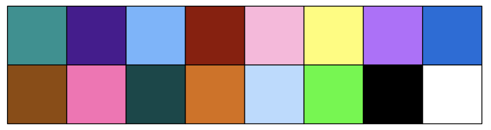

background-image: url(imgs/grid.png)
background-size: cover

```{r setup, include=FALSE}
options(htmltools.dir.version = FALSE)
ggplot2::theme_set(ggplot2::theme_minimal(base_size = 20))
```

### What to expect

.pull-left[
#### Day 1
- Introduction<br>
- Tips & Tricks<br>
- ggplot2<br>
- BYOD
]

.pull-right[
#### Day 2
- Tools
- Resources 
- Data viz challenge
- Presentations
]

---

class: center, middle

background-image: url(imgs/grid.png)
background-size: cover

# Introductions
---
### Me
- Cohort 1 CRT student
- Interested in data visualisation
- Currently work for a drug discovery startup based in Toronto


---
### Me 
- Cohort 1 CRT student
- Interested in data visualisation
- Currently work for a drug discovery startup based in Toronto


---
### Me 
- Cohort 1 CRT student
- Interested in data visualisation
- Currently work for a drug discovery startup based in Toronto


---
## Why you should care about data visualisation

Find hidden patterns in data

.center[
 
]
---
## Why you should care about data visualisation

Charts change minds

.center[
 
]
---
## Why you should care about data visualisation

Charts change minds

.center[
 
]
---
## Why you should care about data visualisation

Good data viz can save lives

.center[
 
]
---
## Why you should care about data visualisation

Good data viz can save lives

.center[
 
 ]
---
## Why you should care about data visualisation

Good data viz can save lives

.center[
 
 ]

---
## Why you should care about data visualisation

Set yourself apart from others

.center[
  
]

---
## What makes a good plot

It depends who you ask...

.pull-left[

.center[Edward Tufte]
]

.pull-right[
- Influential voice on data visualisation
- Coined the terms “chart junk” and “data-ink ratio”
- “The number of information carrying (variable) dimensions depicted should not exceed the number of dimensions in the data”
]

---
## What makes a good plot

It depends who you ask...

.pull-left[
.center[
Florence Nightingale<br>
<br>
Pioneer of colourful, clear visualisations aimed at a popular audience
]
]

.pull-right[
 
]
---

class: center, middle

background-image: url(imgs/grid.png)
background-size: cover

# Tips & Tricks
---
## Choosing the correct chart type
Considerations
- What type of data are you working with - distribution or trend in a single variable or a relationship or comparison between multiple variables 
- What is the audience for the visualisation -  lab meeting, conference presentation, thesis/publication
- What question do you want the plot to answer
--
.center[
<br>
*Choose a chart type that will visualise the message you want to convey in the most effective and obvious way*
]

---
## Colour ♥️💙💚💛💜

Palette types

.center[
 
]
---
## Colour ♥️💙💚💛💜
Colour blindness
.center[

]
---
## Colour ♥️💙💚💛💜
Colour blindness
.pull-left[
Quantitative (sequential)

[viridis palettes](https://cran.r-project.org/web/packages/viridis/vignettes/intro-to-viridis.html)
]

.pull-right[
Quantitative (diverging)

[Seurat purple yellow](http://satijalab.org/seurat/reference/custompalette)
<br><br>
Qualitative

[Martin Kryzwinski palettes](https://mk.bcgsc.ca/colorblind/palettes.mhtml)
]
---
## Colour ♥️💙💚💛💜
Colour blindness
.pull-left[
Quantitative (sequential)

[viridis palettes](https://cran.r-project.org/web/packages/viridis/vignettes/intro-to-viridis.html)
]

.pull-right[
Quantitative (diverging)

[Seurat purple yellow](http://satijalab.org/seurat/reference/custompalette)
<br><br>
Qualitative

[Martin Kryzwinski palettes](https://mk.bcgsc.ca/colorblind/palettes.mhtml)
]

---
## Colour ♥️💙💚💛💜
Colour blindness
.pull-left[
Quantitative (sequential)

[viridis palettes](https://cran.r-project.org/web/packages/viridis/vignettes/intro-to-viridis.html)
]

.pull-right[
Quantitative (diverging)

[Seurat purple yellow](http://satijalab.org/seurat/reference/custompalette)
<br><br>
Qualitative

[Martin Kryzwinski palettes](https://mk.bcgsc.ca/colorblind/palettes.mhtml)
]
---
## Colour ♥️💙💚💛💜
Be consistent<br>
<br>
[*Horkan et al, 2025*](https://www.nature.com/articles/s41467-025-57168-z)

---
## Colour ♥️💙💚💛💜
Be consistent... but not like this...
