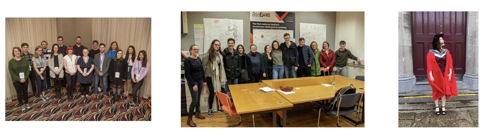
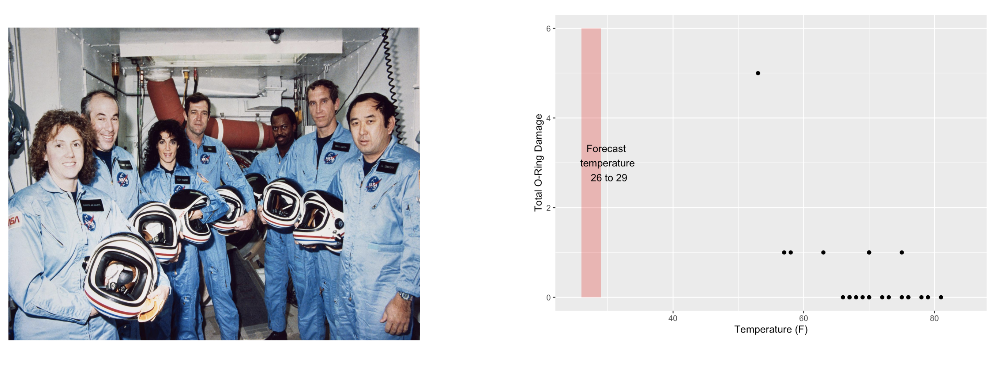
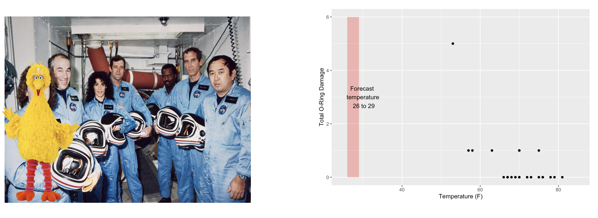
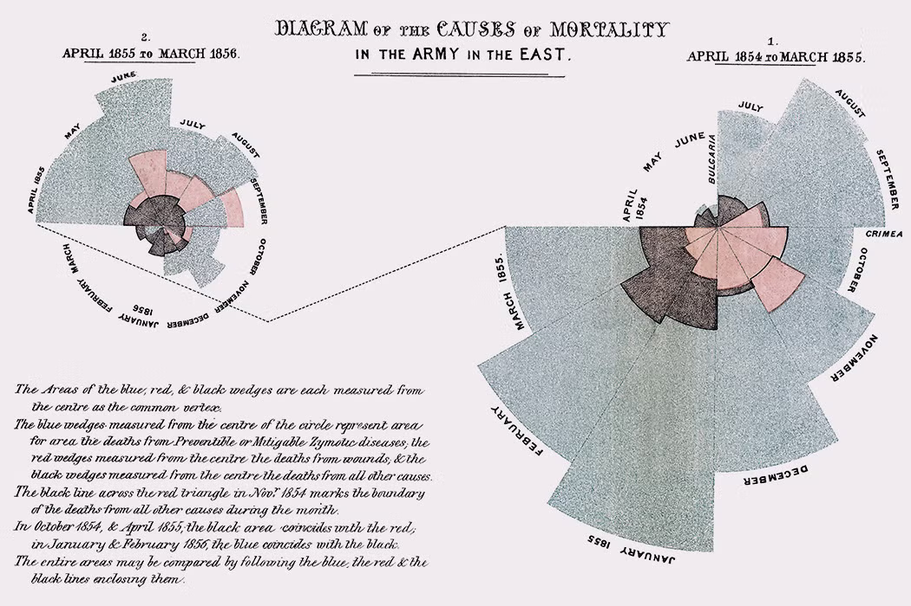
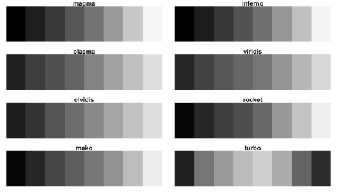
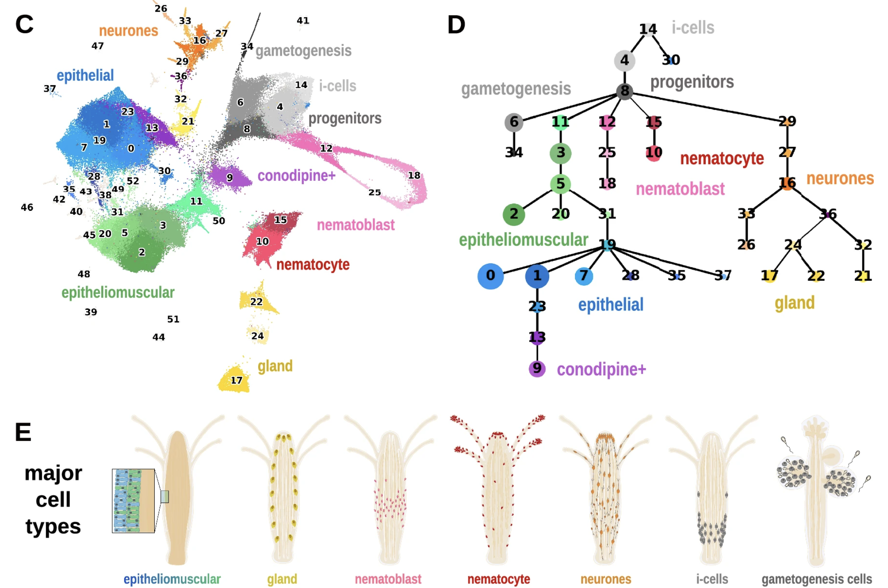

background-image: url(imgs/grid.png)
background-size: cover

```{r setup, include=FALSE}
options(htmltools.dir.version = FALSE)
library(utilitRees)
```

### What to expect

.pull-left[
#### Day 1
- Introduction<br>
- Tips & Tricks<br>
- ggplot2<br>
- BYOD
]

.pull-right[
#### Day 2
- Tools
- Resources 
- Data viz challenge
- Presentations
]

---

class: center, middle

background-image: url(imgs/grid.png)
background-size: cover

# Introductions
---
### Me
- Cohort 1 CRT student
- Interested in data visualisation
- Currently work for a drug discovery startup based in Toronto


---
### Me 
- Cohort 1 CRT student
- Interested in data visualisation
- Currently work for a drug discovery startup based in Toronto


---
### Me 
- Cohort 1 CRT student
- Interested in data visualisation
- Currently work for a drug discovery startup based in Toronto


---
## Why you should care about data visualisation

Find hidden patterns in data

.center[
 
]
---
## Why you should care about data visualisation

Charts change minds

.center[
 
]
---
## Why you should care about data visualisation

Charts change minds

.center[
 
]
---
## Why you should care about data visualisation

Good data viz can save lives

.center[
 
]
---
## Why you should care about data visualisation

Good data viz can save lives

.center[
 
 ]
---
## Why you should care about data visualisation

Good data viz can save lives

.center[
 
 ]

---
## Why you should care about data visualisation

Set yourself apart from others

.center[
  
]

---
## What makes a good plot

It depends who you ask...

.pull-left[

.center[Edward Tufte]
]

.pull-right[
- Influential voice on data visualisation
- Coined the terms “chart junk” and “data-ink ratio”
- “The number of information carrying (variable) dimensions depicted should not exceed the number of dimensions in the data”
]

---
## What makes a good plot

It depends who you ask...

.pull-left[
.center[
Florence Nightingale<br>
<br>
Pioneer of colourful, clear visualisations aimed at a popular audience
]
]

.pull-right[
 
]
---

class: center, middle

background-image: url(imgs/grid.png)
background-size: cover

# Tips & Tricks
---
## Choosing the correct chart type
Considerations
- What type of data are you working with - distribution or trend in a single variable or a relationship or comparison between multiple variables 
- What is the audience for the visualisation -  lab meeting, conference presentation, thesis/publication
- What question do you want the plot to answer
--
.center[
<br>
*Choose a chart type that will visualise the message you want to convey in the most effective and obvious way*
]

---
## Colour ♥️💙💚💛💜

Palette types

.center[
 
]
---
## Colour ♥️💙💚💛💜
Colour blindness
.center[

]
---
## Colour ♥️💙💚💛💜
Colour blindness
.pull-left[
Quantitative (sequential)

[viridis palettes](https://cran.r-project.org/web/packages/viridis/vignettes/intro-to-viridis.html)
]

.pull-right[
Quantitative (diverging)

[Seurat purple yellow](http://satijalab.org/seurat/reference/custompalette)
<br><br>
Qualitative

[Martin Kryzwinski palettes](https://mk.bcgsc.ca/colorblind/palettes.mhtml)
]
---
## Colour ♥️💙💚💛💜
Colour blindness
.pull-left[
Quantitative (sequential)

[viridis palettes](https://cran.r-project.org/web/packages/viridis/vignettes/intro-to-viridis.html)
]

.pull-right[
Quantitative (diverging)

[Seurat purple yellow](http://satijalab.org/seurat/reference/custompalette)
<br><br>
Qualitative

[Martin Kryzwinski palettes](https://mk.bcgsc.ca/colorblind/palettes.mhtml)
]

---
## Colour ♥️💙💚💛💜
Colour blindness
.pull-left[
Quantitative (sequential)

[viridis palettes](https://cran.r-project.org/web/packages/viridis/vignettes/intro-to-viridis.html)
]

.pull-right[
Quantitative (diverging)

[Seurat purple yellow](http://satijalab.org/seurat/reference/custompalette)
<br><br>
Qualitative

[Martin Kryzwinski palettes](https://mk.bcgsc.ca/colorblind/palettes.mhtml)
]
---
## Colour ♥️💙💚💛💜
Be consistent<br>
<br>
[*Horkan et al, 2025*](https://www.nature.com/articles/s41467-025-57168-z)

---
## Colour ♥️💙💚💛💜
Be consistent... but not like this...


---
## Ordering variables
.center[

]

---
## Ordering variables
.center[

]

---
## Avoid rotated labels

.center[

]

---
## Use annotations and labels


[*Stokes et al, 2022*](https://arxiv.org/abs/2208.01780)

--


---
## Themes

.left-code[
```{r theme, eval=FALSE}
library(ggplot2)
library(palmerpenguins)
data(package = 'palmerpenguins')

ggplot(penguins, 
       aes(x = bill_length_mm, 
           y = bill_depth_mm, 
           col = sex)) +
  geom_point() +
  facet_wrap(~species)
```
]

.right-plot[
```{r theme-out, ref.label="theme", warning=FALSE, message=FALSE, echo=FALSE, fig.dim=c(9.6, 7.75), out.width="100%"}
```
]

---
## Themes

.left-code[
```{r theme1, eval=FALSE}
library(ggplot2)
library(palmerpenguins)
data(package = 'palmerpenguins')

ggplot(penguins, 
       aes(x = bill_length_mm, 
           y = bill_depth_mm, 
           col = sex)) +
  geom_point() +
  facet_wrap(~species) +
  theme_minimal(base_size = 14) #<<
```
]

.right-plot[
```{r theme1-out, ref.label="theme1", warning=FALSE, message=FALSE, echo=FALSE, fig.dim=c(9.6, 7.75), out.width="100%"}
```
]

---
## Themes

.left-code[
```{r theme2, eval=FALSE}
library(ggplot2)
library(palmerpenguins)
data(package = 'palmerpenguins')

ggplot(penguins, 
       aes(x = bill_length_mm, 
           y = bill_depth_mm, 
           col = sex)) +
  geom_point() +
  facet_wrap(~species) +
  theme_bough() #<<
```
]

.right-plot[
```{r theme2-out, ref.label="theme2", warning=FALSE, message=FALSE, echo=FALSE, fig.dim=c(9.6, 7.75), out.width="100%"}
```
]

---
## Interactivity and animation

.pull-left[
- Plots don’t have to be static
- Consider animations for presentations
- Link to interactive apps in your publications/thesis
]

.pull-right[

]

---

class: center, middle

background-image: url(imgs/grid.png)
background-size: cover

# ggplot2
---
## ggplot2


---
## The grammar of graphics
.pull-left[
- Language proposed by Leland Wilkinson in 2005
- Foundation for building almost any type of plot
- Plots are built up in sequential layers
- Implemented in ggplot2 package as well as other packages
]

.pull-right[

]
---
## The grammar of graphics

.left-code[
```{r gg1, eval=FALSE}
ggplot(data = mpg, 
       aes(x = hwy, y = displ, 
           color = class)) 
```
]

.right-plot[
```{r gg1-out, ref.label="gg1", warning=FALSE, message=FALSE, echo=FALSE, fig.dim=c(7, 4),  dpi=300, out.width="100%"}
```
]
---
## The grammar of graphics

.left-code[
```{r gg2, eval=FALSE}
ggplot(data = mpg, 
       aes(x = hwy, y = displ, 
           color = class)) +
  geom_point()
```
]

.right-plot[
```{r gg2-out, ref.label="gg2", warning=FALSE, message=FALSE, echo=FALSE, fig.dim=c(7, 4),  dpi=300, out.width="100%"}
```
]
---
## The grammar of graphics

.left-code[
```{r gg3, eval=FALSE}
ggplot(data = mpg, 
       aes(x = hwy, y = displ, 
           color = class)) +
  geom_point() +
  scale_colour_manual(values = rainbow(7))
```
]

.right-plot[
```{r gg3-out, ref.label="gg3", warning=FALSE, message=FALSE, echo=FALSE, fig.dim=c(7, 4),  dpi=300, out.width="100%"}
```
]
---
## The grammar of graphics

.left-code[
```{r gg4, eval=FALSE}
ggplot(data = mpg, 
       aes(x = hwy, y = displ, 
           color = class)) +
  geom_point() +
  scale_colour_manual(values = rainbow(7)) +
  labs(x = 'Highway miles per gallon',
       y = 'Engine displacement (litres)')
```
]

.right-plot[
```{r gg4-out, ref.label="gg4", warning=FALSE, message=FALSE, echo=FALSE, fig.dim=c(7, 4),  dpi=300, out.width="100%"}
```
]

---
## The grammar of graphics

.left-code[
```{r gg5, eval=FALSE}
ggplot(data = mpg, 
       aes(x = hwy, y = displ, 
           color = class)) +
  geom_point() +
  scale_colour_manual(values = rainbow(7)) +
  labs(x = 'Highway miles per gallon',
       y = 'Engine displacement (litres)') +
  theme_linedraw(base_size = 12)
```
]

.right-plot[
```{r gg5-out, ref.label="gg5", warning=FALSE, message=FALSE, echo=FALSE, fig.dim=c(7, 4),  dpi=300, out.width="100%"}
```
]

---
## A more relevant example
How to get from this...


---
## A more relevant example
To this...

---
## Basic plot
```{r,fig.dim=c(12, 4),  dpi=300, out.width="100%"}
marker_df <- read.csv('https://raw.githubusercontent.com/Sarah145/CRT-data-viz/refs/heads/main/data/bm_marker_genes.csv')

ggplot(marker_df, 
       aes(x = gene, y = celltype, colour = scaled_avg_exp, size = per_exp)) +
  geom_point() +
  theme(axis.text.x = element_text(angle = 90, hjust = 1, vjust = 0.5))
```

---
## Enhanced plot
Setup...
```{r}
library(ggtext)

gene_order <- c('SDC1','MME','CD19','CD79A','MS4A1','KIT','CD34','CLC','GYPA','PPBP','ITGA2B','CD33','MPO','CTSG','AZU1','LYZ','S100A8','S100A9','CD14','ITGAM','FCGR3A','FCER1G','FCER1A','CLEC10A','IL3RA','IRF8','CD4','IL7R','CD3E','CCR7','CD8A','CCL5','GNLY','KLRB1','NKG7','CXCL12','VCAM1')

celltype_cols <- c(Plasma="#333333", CLP="#B2EF9B", Pre.B="#3A7219", B="#1B360C", HSC.MPP="#F7D760", MEP="#B84F09", Late.Eryth="#6D2F05", Megakaryocytes="#F7A660", GMP="#DE9197", CD14.Mono="#AD343E", CD16.Mono="#BD0000", cDC="#FF0378", pDC="#FC5E03", CD4.N="#015073",CD4.M="#96CBFE", CD8.N="#16B8B2", CD8.M="#946CD5", NK="#4D1282", Mesenchymal="#702127")

gradient_cols <- colorRampPalette(c('#190C3E', '#87216B', '#E55C30', '#F7D340'))

y_labs <- paste0("<span style='color:", celltype_cols, "'>", names(celltype_cols), "</span>")

head(y_labs)
```

---
## Enhanced plot

```{r,fig.dim=c(16, 4),  dpi=300, out.width="100%"}
ggplot(marker_df, 
       aes(x = gene, y = celltype, colour = scaled_avg_exp, size = per_exp)) +
  geom_point() + 
  scale_x_discrete(limits = gene_order) +
  scale_y_discrete(limits = rev(names(celltype_cols)), labels = rev(y_labs)) +
  scale_colour_gradientn(colours = gradient_cols(100)) +
  scale_size(labels = scales::percent, range = c(0.5, 4)) +
  labs(x = NULL, y = NULL, colour = 'Avg. expression\n(scaled 0-1)', size = '% cells\nexpressing\ngene') +
  guides(colour = guide_colourbar(order = 1, barlength = unit(6, 'lines')), size = guide_legend(order = 2)) +
  theme_linedraw(base_size = 14) +
  theme(axis.text.x = element_text(angle = 90, hjust = 1, vjust = 0.5),
        axis.text.y = element_markdown(face = 'bold'),
        legend.title = element_text(size = 12, vjust = 0.5),
        legend.box.margin = margin(t = 45))
```

---

class: center, middle

background-image: url(imgs/grid.png)
background-size: cover

# BYOD