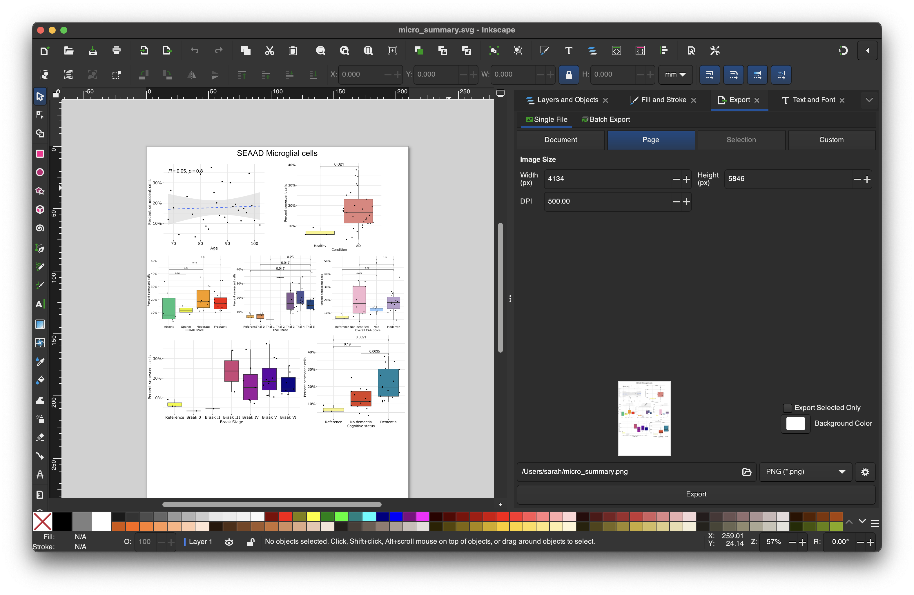
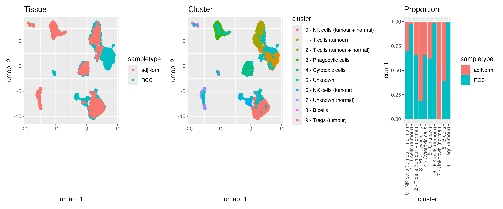
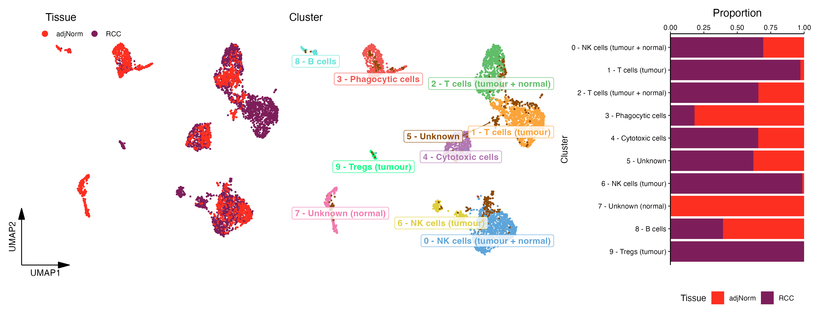

class: center, middle

background-image: url(imgs/grid.png)
background-size: cover

```{r setup, include=FALSE}
options(htmltools.dir.version = FALSE)
ggplot2::theme_set(ggplot2::theme_minimal(base_size = 20))
```

# ggplot2 extensions

---
### ggrepel
.left-code[
```{r ggrepel, eval=FALSE}
library(ggplot2)
library(ggrepel)

df <- data.frame(x = rnorm(10, 10, 5), 
                 y = rnorm(10,10,10), 
                 label = sample(LETTERS, 10))
ggplot(df, aes(x = x, y = y)) +
  geom_point() +
  geom_text_repel(aes(label = label), size = 8)   #<<
```
]

.right-plot[
```{r ggrepel-out, ref.label="ggrepel", echo=FALSE, fig.dim=c(9.6, 8.1), out.width="100%"}
```
]

---
### ggtext
.left-code[
```{r ggtext, eval=FALSE}
library(ggtext)

df$label <- paste0("<span style='color:red'>", #<<
                   df$label,          #<<
                   "</span>")     #<<

ggplot(df, aes(x = x, y = y)) +
  geom_richtext(aes(label = label), size = 10)    #<<
```
]

.right-plot[
```{r ggtext-out, ref.label="ggtext", echo=FALSE, fig.dim=c(9.6, 8.1), out.width="100%"}
```
]

---
### ggforce
.left-code[
```{r ggforce, eval=FALSE}
library(ggforce)

df <- data.frame(x = rep(c('A','B'), each = 100),
                 y = c(rnorm(100, 10, 20),
                       rnorm(100, 20, 5)))

ggplot(df, aes(x = x, y = y)) +
  geom_sina() +  #<<
  geom_violin(fill = 'transparent',
              draw_quantiles = 0.5)
```
]

.right-plot[
```{r ggforce-out, ref.label="ggforce", echo=FALSE, fig.dim=c(9.6, 8.1), out.width="100%"}
```
]

---
### ggpubr
.left-code[
```{r ggpubr, eval=FALSE}
library(ggpubr)

ggplot(df, aes(x = x, y = y)) +
  geom_sina() +  
  geom_violin(fill = 'transparent',
              draw_quantiles = 0.5) +
  stat_compare_means( #<<
    comparisons = list(c('A','B')), size = 10)  #<<
```
]

.right-plot[
```{r ggpubr-out, ref.label="ggpubr", echo=FALSE, fig.dim=c(9.6, 8.1), out.width="100%"}
```
]

---
### ggfx
.left-code[
```{r ggfx, eval=FALSE}
library(ggfx)

ggplot(df, aes(x = x, y = y)) +
  with_blur(geom_jitter(), #<<
            sigma = unit(1, 'mm')) #<<
```
]

.right-plot[
```{r ggfx-out, ref.label="ggfx", echo=FALSE, fig.dim=c(9.6, 8.1), out.width="100%"}
```
]

---

class: center, middle

background-image: url(imgs/grid.png)
background-size: cover

# Other R packages & things you should know about
---
### UpSetR

.left-code[
```{r UpSetR, eval=FALSE}
library(UpSetR)

up_list <- list(A = sample(letters, 20), 
                B = sample(letters, 10), 
                C = sample(letters, 20), 
                D = sample(letters, 5))

upset(fromList(up_list), text.scale = 2)

```
]
.right-plot[
```{r UpSetR-out, ref.label="UpSetR", echo=FALSE, fig.dim=c(9.6, 8.1), out.width="100%"}
```
]

.doc-link[
[*UpSetR documentation*](https://github.com/hms-dbmi/UpSetR)
]
---
### ComplexHeatmap

.left-code[
```{r ComplexHeatmap-dummy, eval=FALSE}
library(ComplexHeatmap)

mat <- matrix(rnorm(1000,0,2),
              nrow = 50,
              dimnames = list(paste0('cell_', 1:50),
                              paste0('gene', 1:20)))

Heatmap(mat)
```
]

```{r ComplexHeatmap, eval=FALSE, include=FALSE}
suppressPackageStartupMessages(library(ComplexHeatmap))

mat <- matrix(rnorm(1000,0,2),
              nrow = 50,
              dimnames = list(paste0('cell_', 1:50),
                              paste0('gene', 1:20)))

Heatmap(mat)
```

.right-plot[
```{r ComplexHeatmap-out, ref.label="ComplexHeatmap", echo=FALSE, fig.dim=c(9.6, 8.1), out.width="100%"}
```
]
.doc-link[
[*ComplexHeatmap documentation*](https://jokergoo.github.io/ComplexHeatmap-reference/book/)
]
---
### circlize

.left-code[
```{r circlize1-dummy, eval=FALSE}
library(circlize)

df <- data.frame(from = rep(LETTERS[1:4], times = 4),
                 to = rep(LETTERS[1:4], each = 4),
                 value = sample(1:100, 16))

chordDiagram(df)
```
]

```{r circlize1, eval=FALSE, include=FALSE}
suppressPackageStartupMessages(library(circlize))
par(cex = 1.75)
df <- data.frame(from = rep(LETTERS[1:4], times = 4),
                to = rep(LETTERS[1:4], each = 4),
                value = sample(1:100, 16))

chordDiagram(df)
```

.right-plot[
```{r circlize1-out, ref.label="circlize1", echo=FALSE, fig.dim=c(9.6, 8.1), out.width="100%"}
```
]
.doc-link[
[*circlize documentation*](https://jokergoo.github.io/circlize_book/book/)
]
---
### circlize

.left-code-wide[
```{r circlize2, eval=FALSE, cache=TRUE}
df <- generateRandomBed(200, species = "hg19")

par(cex = 1.5)

circos.initializeWithIdeogram(species = "hg19")
circos.genomicTrack(df, 
                    panel.fun = function(region, value, ...){
    circos.genomicPoints(region, value, ...)
                      }
    )
```
]


.right-plot-narrow[
```{r circlize2-out, ref.label="circlize2", echo=FALSE, fig.dim=c(8, 8.1), out.width="100%", cache=TRUE}
```
]

.doc-link[
[*circlize documentation*](https://jokergoo.github.io/circlize_book/book/)
]
---
### karyoploteR

.left-code-wide[
```{r karyoploteR-dummy, eval=FALSE, cache=TRUE}
library(karyoploteR)

df <- data.frame(chr = 'chr1', 
                 positions = runif(10, min = 0, max = 2.4e8))

kp <- plotKaryotype(plot.type = 2,
                    chromosomes = c('chr1'))
kpPlotMarkers(kp, chr = df$chr, x = df$positions,
              labels = NA, adjust.label.position = F)
```
]

```{r karyoploteR, eval=FALSE, include =FALSE, cache=TRUE}
suppressPackageStartupMessages(library(karyoploteR))

df <- data.frame(chr = 'chr1', 
                 positions = runif(10, min = 0, max = 2.4e8))

kp <- plotKaryotype(plot.type = 2,
                    chromosomes = c('chr1'))
kpPlotMarkers(kp, chr = df$chr, x = df$positions,
              labels = NA, adjust.label.position = F)
```

.right-plot-narrow[
```{r karyoploteR-out, ref.label="karyoploteR", echo=FALSE, fig.dim=c(8, 8.1), out.width="100%", cache=TRUE}
```
]

.doc-link[
[*karyoploteR documentation*](https://bernatgel.github.io/karyoploter_tutorial/)
]

---
### patchwork and cowplot

```{r patch-cow1, message=FALSE, warning=FALSE, dpi=300, fig.dim=c(16,6), out.width="100%"}
library(patchwork)

p1 <- ggplot(mpg, aes(x = hwy, y = displ)) +
  geom_point()
p2 <- ggplot(mpg, aes(x = cty)) +
  geom_histogram()

p1 + p2 + plot_annotation(tag_levels = 'A')
```

---
### patchwork and cowplot

```{r patch-cow2, message=FALSE, warning=FALSE, dpi=300, fig.dim=c(16,6), out.width="100%"}
library(cowplot)

plot_list <- list(p1,p2)
plot_grid(plotlist = plot_list, labels = 'AUTO')
```

---
### Inkscape
.center[

]

.doc-link[
[Inkscape website](https://inkscape.org/)
]
---
### Python packages
.center[

]

---
### Where to look for...

Good advice
.link-list[
- [Datawrapper blog](https://www.datawrapper.de/blog/category/datavis-dos-and-donts)

- [Friends don't let friends make bad graphs](https://github.com/cxli233/FriendsDontLetFriends/tree/main)
]

Inspiration 
.link-list[
- [R graph gallery](https://r-graph-gallery.com/)
- [TidyTuesday](https://bsky.app/search?q=%23TidyTuesday) & [30DayChartChallenge](https://bsky.app/search?q=%2330DayChartChallenge)
]

Pretty colour palettes
.link-list[
- [Coolors.co](https://coolors.co/generate)
]

---
class: center, middle

background-image: url(imgs/grid.png)
background-size: cover

# ✨ Plot makeover challenge ✨
---
### Plot makeover challenge
Before...
.center[

]

---
### Plot makeover challenge
...After
.center[

]

